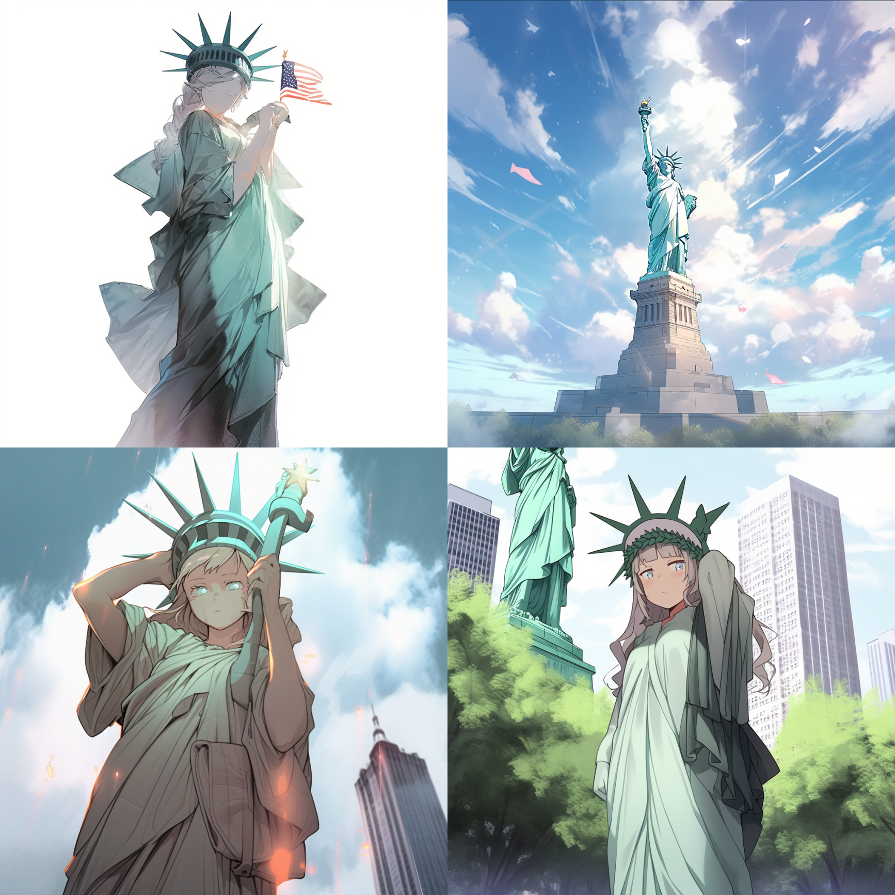

# 👺 Anime List

这个 List 里的内容，我会在我的[小红书账号](https://www.xiaohongshu.com/user/profile/6073d38d00000000010068a6?xhsshare=CopyLink&appuid=6073d38d00000000010068a6&apptime=1679646639)上同步更新。感兴趣的朋友可以去关注下。

| 
**照片**
  | **名称**                     | **介绍**                                                                                                                                            |
| ------ | -------------------------- | ------------------------------------------------------------------------------------------------------------------------------------------------- |
|        | Chibi Anime Style          | Chibi Anime Style 是指卡通迷你风格。是一种独特的绘画风格，特别受到日本动漫迷和卡通迷的喜爱。该风格的特点是将角色绘制成缩小版的样式，更加可爱和卡通化。在这种风格下，一些角色的头比正常比例大得多，人物的描绘也更加简化，并且动画在绘制时常常用短暂时间的快速动作来传递动态效果。 |
|        | Gakuen Anime Style         | Gakuen Anime Style是指在日本动漫中常见的一种风格，主要呈现校园生活与高中生活的情境。这种风格的作品通常涉及到学生会、文化节、恋爱、友情、竞争等校园主题，角色也往往是年龄在16-18岁之间的学生。                                        |
|        | Gekiga Anime Style         | Gekiga Anime Style是一种比较沉重、严肃的日本漫画风格，常常涉及社会问题、人生哲理等成人主题。这种风格的特点是以黑色、灰色为主色调，图像表现力较强，人物表情和行为也更加真实。                                                   |
|        | J Horror Anime Style       | J Horror Anime Style是指恐怖题材的日本动漫风格，这种风格的作品常常涉及灵异、鬼怪、妖怪等超自然力量。                                                                                      |
|        | Jidaimono Anime Style      | Jidaimono Anime Style是指日本历史剧题材的动漫风格，通常呈现古代日本的历史背景和文化特征。这种风格的作品往往描绘战争、家族斗争、忍者、武士道、神话传说等元素，以及用具有浓重日本特色的艺术表现手法来传递历史文化的内涵。                            |
|        | Kawaii Anime Style         | Kawaii Anime Style是一种非常可爱和萌的动漫风格，通常呈现出像动物、小孩、角色等可爱的形象。这种风格的作品以颜色鲜明、轮廓粗糙、脸部表情夸张为主要特点。                                                              |
|        | Mecha Anime Style          | Mecha Anime Style是以机器人为主题的日本动漫风格，通常呈现出大型机器、机甲战争、铁甲舞者等元素。这种风格的作品常常运用科幻、未来世界设定、大规模战斗等元素，以及动态的战斗场面和机器人设计，塑造出复杂的机器人世界和角色人物关系。                         |
|        | Realistic Anime Style      | Realistic Anime Style是一种真实主义的日本动漫风格，通常呈现出秉持着更加现实和真实的人物形象和情节。这种风格的作品表现力很强，人物形象、环境场景等具有更多的细节，刻画出更为真实的情感世界。                                          |
|        | Semi-Realistic Anime Style | Semi-Realistic Anime Style是在Realistic Anime Style和 Anime Style之间的一个中间状态的风格，风格上比较真实，但是仍带有一定的动漫风格。这种风格的作品通常涉及到带有现实性的情节和人物，但是也常常运用到动漫风格的表现手法。        |
|        | Shoji Anime Style          | Shoji Anime Style是按照日本漫画家小学馆长生涯逐步形成的一种风格。这种风格的作品，通常以聚焦单个人物或小团体的故事为主线。其特点是画面明亮，颜色和谐，人物表情和行为搞笑夸张，情节简洁易懂。                                            |
|        | Kemonomimi Anime Style     | Kemonomimi Anime Style是一种带有动物耳朵和尾巴等特征的日本动漫风格，通常以人类或近似人类的形象呈现，但却带有不同种类的动物耳朵和尾巴等特征。这种风格的作品与少女漫画(girls' manga)、少年漫画(boys' manga)等风格都有一定的关系。          |